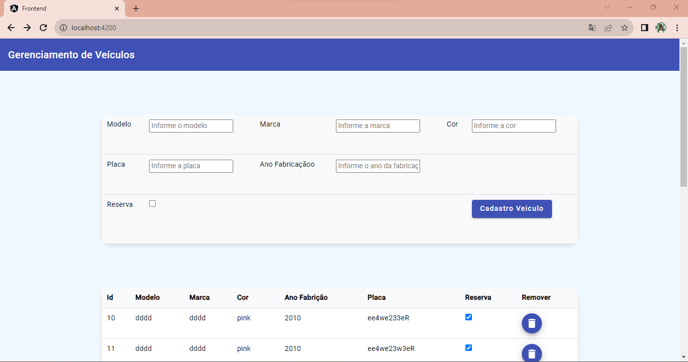
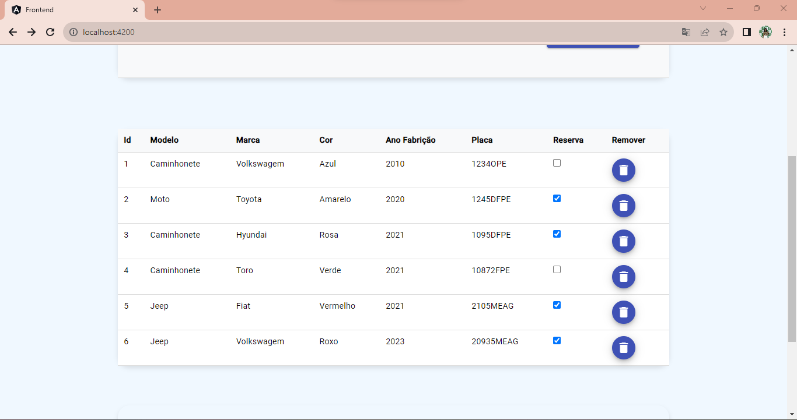

# Front-End da Aplicação de Gerenciamento de Veiculos

Um a aplicação de gerenciamento de veiculos, desenvolvido com Spring Boot no backend e Angular no frontend. Permite cadastrar e remover veículos, fazer reservas e buscar carros disponíveis. Este repositório contém o código fonte do backend e do frontend. Recomendo abrir um em cada arquivo, pois é necessário rodar ambos ao mesmo tempo, para que se possa ver a API completa. Essa API tem como proposito o gerenciamento de uma loja que realiza alugueis de veículos, e se encontrava em necessidade de um gerenciador de veículos e reservas.

# Frontend

Esse projeto foi gerado com [Angular CLI](https://github.com/angular/angular-cli) version 15.2.0,e teve a utlização da bilioteca Angular Material, durante seu desenvolvimento, é necessário que seja adicionado através do terminal: ng add @angular/material. Além do uso do Angular Material, também tivemos o uso do BootStrap, por meio CDN, então não há a necessidade da instalação.

## Development server

Para iniciar o servidor, se usa `ng serve` no terminal. Digite a URL `http://localhost:4200/`. A aplicação vai automaticamente se atualizar enquanto ligada.

## Code scaffolding

O trecho `ng generate component component-name` é usado para gerar um componente.

## Uso

Caso queira ver as rotas em acão, dessa vez em tabelas e botões, primeiramente, é necessário iniciar sua aplicação e ir para a URL http://localhost:4200/. O programa se encontra com apenas umapagina principal, amas essa pagina tem uma tabela que permite apagar, visualizar a tabela e cadastrar.

## Tela

Logo abaixo, temos a primeira parte da tela: A tabela de cadastro!

;

A seguir temos a tabela mesmo, com todos os veiculos cadastrados!

;
